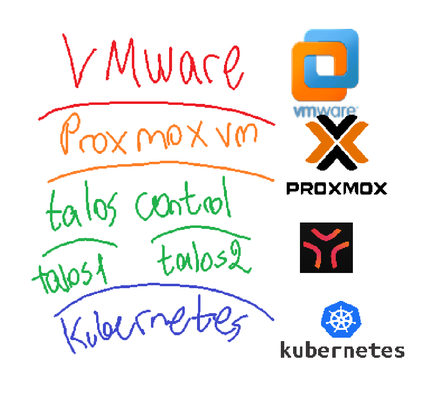

# cloudsec

## lab

[setting up](cloudsec/setting%20up%203be9d179033380b3aadcd80683299602.md)

[installing proxmox](cloudsec/installing%20proxmox%203bf9d1790333804397e8d8f9d3697777.md)

[8006](cloudsec/8006%203c19d179033380d1be9cf3632834509d.md)

[roles](cloudsec/roles%203ce9d17903338051b575d6de92ff06a9.md)

[puppy vm creation](cloudsec/puppy%20vm%20creation%203ce9d17903338058a425d0f15f5d9d63.md)

[RBAC](cloudsec/RBAC%203e19d179033380a091a9ed370053aa21.md)

[installing node2 proxmox ](cloudsec/installing%20node2%20proxmox%203e39d1790333805999bfe662e8fb11b2.md)

[cluster creation and joining](cloudsec/cluster%20creation%20and%20joining%203e39d179033380ae810ade98f2d65ef2.md)

[live migration of puppy vm](cloudsec/live%20migration%20of%20puppy%20vm%203e89d17903338031a40efe7fc2557b6b.md)

[building Talos inside proxmox](cloudsec/building%20Talos%20inside%20proxmox%203e89d179033380dd9debce5181b7feb5.md)

[working with talos](cloudsec/working%20with%20talos%203e89d179033380579803cbbb2f9c1309.md)

[starting talos’ after shutting down](cloudsec/starting%20talos%E2%80%99%20after%20shutting%20down%203e99d17903338037ac40d2e2faa2e92a.md)

[container network interface CNI](cloudsec/container%20network%20interface%20CNI%203e99d1790333803e96f3c356a8954009.md)

[scaling with replicas](cloudsec/scaling%20with%20replicas%203e99d1790333803096bbd0b7a9930a38.md)

[what happens if one worker node dies?](cloudsec/what%20happens%20if%20one%20worker%20node%20dies%203e99d179033380918a92eae811674e02.md)

---

### What is demonstrated in the project

- **Virtualization fundamentals** - nested hypervisors (VMware → Proxmox → Talos), KVM/QEMU internals, CPU topology troubleshooting
- **Infrastructure-as-a-platform** - building and clustering a real hypervisor (Proxmox), not just clicking through a tutorial
- **Access control design** - RBAC with scoped roles/groups, principle of least privilege in practice
- **High availability concepts** - quorum, corosync, live migration, what breaks when a node dies and why
- **Container orchestration** - Kubernetes on Talos, deployments, services, scaling, node failure handling
- **Systems debugging** - incidents/fails documented

### Running private cloud infrastructure

what makes this project cloud:

- **self-service** - requesting a VM without needing a human to manually provision it (Proxmox's "Create VM" button, or `kubectl create deployment`, both qualify)
- **Resource pooling** - many workloads share the same underlying physical hardware, abstracted away from the user (Proxmox node's CPU/RAM is a shared pool that VMs draw from)
- **Rapid elasticity** - scale up/down easily
- **Measured/metered usage** - the system tracks resource consumption (Proxmox's per-VM resource graphs, Kubernetes' `requests`/`limits` and `kubectl top`)
- **Broad network access** - reachable over the network via standard interfaces, not requiring physical access (web UI, `kubectl` over the API)

**proxmox + talos + kubernetes =** computers inside a computer inside computer

##

<aside>
📝

    why use containers?

    while running a program/app, versions of the installed libraries and functions might differ so having static programs running in one space causes less problems

    easy way to run apps in isolated spaces on one computer - apps like databases for websites, the request to the database would go through containers

    container also is like loadbalancer, but here its job is fault tolerance. bunch of containers (just like kubernetes does) handle a lot of requests better.

    so that dependencies don’t conflict

    the app will work the same on every machine

    turn off Hyper-V of the computer as its own hyperv because here, vmware/proxmox will be acting like one

    vmware will complain if its ON on the computer because it will try and be dominant but it wont be able to cuz of the computer

    but ON on vmware in the settings - CPU virtualization (VT-x/AMD-V)

</aside>

---



---

# Concept/General explanations ->

## proxmox

proxmox is a virtual computer having ability to create virtual computers within it

type 1 hypervisor

**pve** - proxmox virtual environment

## talOS

OS designed for kubernetes, its what k8s runs

VMs run inside proxmox having talos OS to support kubernetes

they’re like virtual computers

control vs worker →

control = management :

**etcd** - stores desired state of the cluster - config

**apiserver** - talos communication w k8s - kubectl comms

**scheduler** - decides, on which talos to send the new working pod

**controller manager** - constantly checks if the desired state is met

worker = where the containers run

kubectl commands affect the worker nodes

creating deployment and changes like that are made on workers

thenn the request that was sent to worker goes to API server and get scheduled by sccheduler

these things that get commanded on the controller, actually happen on the worker and the worker reports back on whats the status to the controller manager

## nodes

=

machine

2 proxmox nodes , clustered = 2 proxmox machines able to communicate with each other

- share info and migrate vms

### kubernetes

runs containers = manages apps

**Cluster** = multiple nodes(talos) managed together by Kubernetes →

```

       ┌────────────┼────────────┐
       ↓            ↓            ↓
    Talos 1      Talos 2      Talos 3
       │            │            │
       └──────── Kubernetes ─────┘
```

talos vm = kubernetes **node**

1 talos must be control pane

rest can be worker nodes

```
 LAPTOP
    │
    │ VMware
    ↓
PROXMOX
    │
    │ creates VMs
    ├───────────────────┐
    ↓                   ↓
TALOS VM             TALOS VM
    │                   │
    │                   │
    ↓                   ↓
K8s NODE              K8s NODE
    │                   │
    └─────────┬─────────┘
              ↓
       KUBERNETES CLUSTER
              │
       ┌──────┼──────┐
       ↓      ↓      ↓
   Container Container Container
       ↓      ↓      ↓
      API   Website  Database
```

- termins in short
  **Talos**
  = OS installed on that VM
  **Node**
  = that Talos machine
  _when it's participating in Kubernetes_
  **Cluster**
  = multiple nodes managed together by Kubernetes
  **Container**
  = where your application actually runs
  **Kubernetes**
  = manages those containers across the nodes
  **Proxmox**
  = creates/manages the VMs

## KVM

kernel based virtual machine

kernel module that allows proxmox to virtualize cpu usage VT-x

VIRTUALIZES CPU

lets vms use cpu

**proxmox cpu usage**

proxmox can create VMs that have vCPUs that exceed physical core count. When the usage of all those VMs (vms working togetherat the same time) exceeds what the physical CPU can deliver, then the vms slow down cuz its overexceding the usage amount.

allocation ≠ usage

## Qemu

emulator = hypervisor, runs on proxmox

uses kvm to run virtual hardware cpu(trhough kvm ) and disk and network

program on guest that opens up /dev/kvm

BUILDS VIRTUAL HARDWARE

**qemu guest agent**

program that needs to be installed inside guest os (vm installed inside proxmox, like puppy vm)

lets proxmox talk to guest OS

talk means = gets ip , shuts down vm

if this doesn’t exist on the vm inside proxmox, then it cant get the ip

**kvm qemu relationship**

laptop cpu has special hardwware in it that has ability to run virtual machines faster. this isn’t allowed to be accessed usually by the browsers or anything. but kvm in the case where program asks to be accessed through /dev/kvm then kvm lets hardware know that it’s okay to trust this place (qemu) and lets the gear be used.

QEMU is the program that builds everything else (disk, network, BIOS, USB) and calls on KVM just for the CPU part.

## **machines**

| Machine        | What it is                                          |                                                                                                                                          |
| -------------- | --------------------------------------------------- | ---------------------------------------------------------------------------------------------------------------------------------------- |
| Proxmox node 1 | A physicalish server running the Proxmox hypervisor | main = hosts the 3 Talos VMs inside it                                                                                                   |
| Proxmox node 2 | A second, separate Proxmox install                  | Only powered on to prove clustering works = show 2 machines can be managed as one team, and a VM can be moved live from node 1 to node 2 |
| Talos control  | A VM running main Talos brain                       | Makes all the scheduling/management decisions for Kubernetes cluster                                                                     |
| Talos worker 1 | worker 1 where container is based                   | Actually runs your containers (e.g. nginx)                                                                                               |
| Talos worker 2 | Same as above                                       | Runs more containers, and is the failover target if worker 1 dies                                                                        |

## my laptop setup

```
Laptop - 16GB RAM
|
|-- VMware Workstation
|
|-- Proxmox Node 1  8GB RAM  <-- a hypervisor
|   |
|   |-- Talos-Control  3GB
|   |-- Talos-Worker-1 1.5GB
|   |-- Talos-Worker-2 1.5GB
|
|-- Proxmox Node 2  3GB RAM, off unless testing clustering

=

12.5 GB RAM
```
