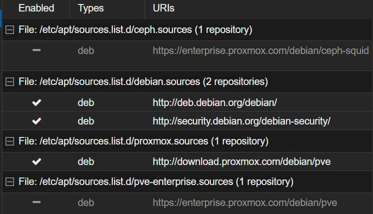

# 8006

click the node → updates → repositories → add no sub + disable enterprise repo

then do `apt update && apt upgrade -y` 

verif commands →

`cat /etc/os-release`

`ip a`

`cat /etc/network/interfaces`

`btrfs fi show`

then if user creation needed , it can be done w datacenter → permissions → users

just to test permissions