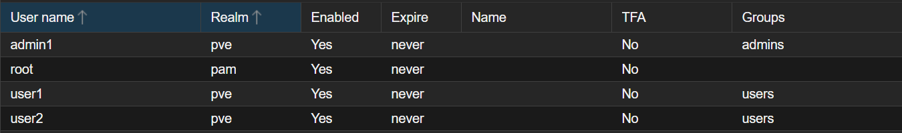

# roles

**Plan:**

1. Create the group 
2. Create the users in the PVE realm
3. Create your first VM - Puppy Linux 
4. Assign the group role - PVEVMUser, scope : vms
5. Log in as a user and confirm access to the VM

1. Datacenter → Permissions → Groups → Create
    1. admins
    2. users
2. Datacenter → Permissions → Users → Add
    
    user: user1, user2, admin1
    
    realm: Proxmox VE authentication server
    
    password: user1changeme, user2changeme, adminchangeme
    
3. add user to the users group, admin to admins

**user1 view**

